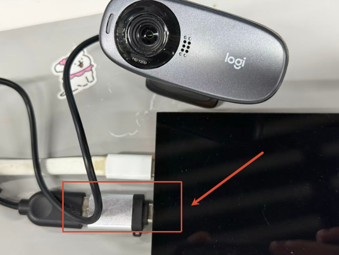
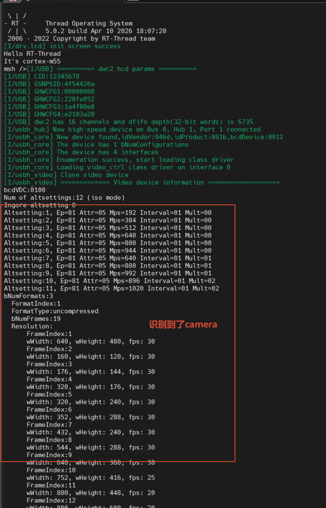
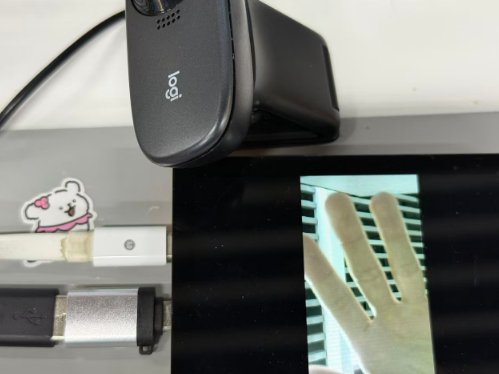
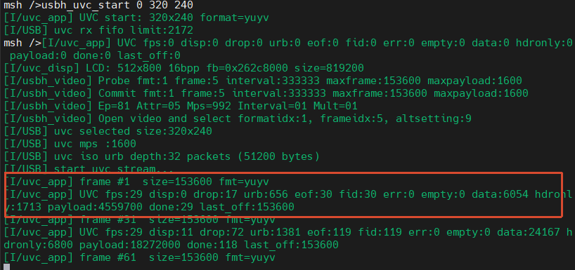

# Edgi_Talk_M55_USB_UVC CherryUSB Example Project

[**中文**](./README_zh.md) | **English**

## Overview

This project runs on the **Edgi-Talk M55 core** and enables **CherryUSB host mode** on the Infineon **DWC2** controller, with **USB Video Class (UVC) host support** enabled by default.

At startup, firmware calls `usbh_initialize(0, USBHS_BASE, NULL)` to bring up USB host. The main loop toggles the green LED (P16_6) as a liveness indicator.

## Default Configuration

Key macros in `rtconfig.h`:

* `RT_USING_CHERRYUSB = y`
* `RT_CHERRYUSB_HOST = y`
* `RT_CHERRYUSB_HOST_DWC2_INFINEON = y`
* `RT_CHERRYUSB_HOST_MSC = y`
* `RT_CHERRYUSB_HOST_VIDEO = y`

This gives a ready baseline for UVC device enumeration and further video application integration.

## Build and Flash

1. Build in RT-Thread Studio or with SCons.
2. Flash firmware via KitProg3 (DAP).
3. Connect a UVC camera (or other USB device) to the Type-C port.

## Configuration

Open RT-Thread Studio:

```
RT-Thread Settings -> USB -> CherryUSB
```

Recommended checks:

* Enable `RT_CHERRYUSB_HOST`
* Select `RT_CHERRYUSB_HOST_DWC2_INFINEON` as host IP
* Enable `RT_CHERRYUSB_HOST_VIDEO` for UVC
* Keep or disable `MSC` and other host classes as needed

If extra USB parameters are needed, edit:

* `libraries/Common/board/ports/usb/usb_config.h`

## Runtime Result

1. Plug a USB camera into the board's USB-OTG interface.

 

2. After boot, the system automatically detects camera capabilities (resolution, format, and related information).

 

3. In the MSH terminal, run `usbh_uvc_start 0 320 240` (`0` = YUYV, `1` = MJPEG, resolution `320x240`).

**Note: Select parameters based on your USB camera's actual supported modes. The maximum supported resolution is only 432x240.**

 

4. Check the serial log output. Frame-rate information is printed once per second.

  

## Startup Sequence

The M55 core depends on the M33 boot flow. Recommended flashing order:

```
+------------------+
|   Secure M33     |
|  (Secure Core)   |
+------------------+
          |
          v
+------------------+
|       M33        |
| (Non-Secure Core)|
+------------------+
          |
          v
+-------------------+
|       M55         |
| (Application Core)|
+-------------------+
```

## Notes

> **Note:** RT-Thread Studio **2.2.9** or newer is recommended.

* If this M55 project does not run, flash `Edgi_Talk_M33_Blink_LED` first.
* Enable CM55 in the M33 project:

  ```
  RT-Thread Settings -> Hardware -> select SOC Multi Core Mode -> Enable CM55 Core
  ```

